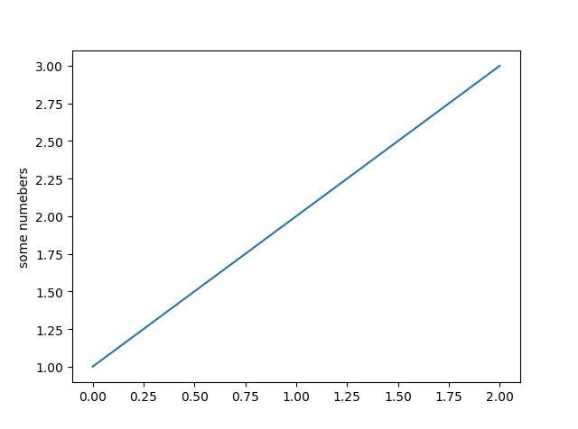

## python 基础

### Anaconda 安装

* [下载地址](https://www.continuum.io/downloads)

* 命令行创建和启动

  `conda create --name py27 python=2.7`

  `activate py27`

* 列出安装的包 `conda list` `conda list -n py27`

* 安装新包 `conda install numpy` （会安装和更新库所依赖的各种库）

* 删除包 `conda remove requests`

* 更新包 `conda update numpy`

* 上述命令 可以通过 -n 指定环境，或者默认当前使用的环境

* 设置国内镜像

  ```python
  # 添加Anaconda的TUNA镜像
  conda config --add channels https://mirrors.tuna.tsinghua.edu.cn/anaconda/pkgs/free/
   
  # 设置搜索时显示通道地址
  conda config --set show_channel_urls yes
  ```

  ​

### 安装一些依赖

```python
conda install ipython
conda install jupyter
conda install numpy
conda install scipy
conda install pandas
conda install matplotlib
```

### Numpy

提供常用的数值数组、矩阵等函数

优点：

*   基于向量化的运算

*   进行数值运算时Numpy数组比list效率高

*   可以直接对数组的每个元素进行操作

    ```python
    In [1]: import numpy as np

    In [2]: np.arange(10)
    Out[2]: array([0, 1, 2, 3, 4, 5, 6, 7, 8, 9])

    In [3]: a = _

    In [4]: a ** 2
    Out[4]: array([ 0,  1,  4,  9, 16, 25, 36, 49, 64, 81])
    ```

    ​

### Scipy

是一种使用numpy来做高等数学、信号处理、优化、统计的扩展包

* Linear Algebra (scipy.linalg)  线性代数

* Statistics (scipy.stats) 统计

* Spatial data structure and algorithms (scipy.spatial) 空间的数据结构和算法

  ```python
  In [5]: from scipy import linalg

  In [6]: A = np.array([[1,2],[3,4]])

  In [7]: A
  Out[7]:
  array([[1, 2],
         [3, 4]])

  In [8]: linalg.det(A)
  Out[8]: -2.0
  ```

  ​

### Pandas

一种基于numpy的高级数据结构和精巧工具，快速简单的处理数据

数据结构：Series和DataFrame

```python
In [9]: import pandas as pd

In [10]: s = pd.Series([1,3,5,np.nan,6,8])

In [11]: s
Out[11]:
0    1.0
1    3.0
2    5.0
3    NaN
4    6.0
5    8.0
dtype: float64

In [12]: dates = pd.date_range("20170101", periods=6)

In [13]: dates
Out[13]:
DatetimeIndex(['2017-01-01', '2017-01-02', '2017-01-03', '2017-01-04',
               '2017-01-05', '2017-01-06'],
              dtype='datetime64[ns]', freq='D')

In [15]: df = pd.DataFrame(np.random.randn(6,4), index=dates, columns=list("ABCD"))

In [16]: df
Out[16]:
                   A         B         C         D
2017-01-01  0.566986  1.496505 -0.581817 -0.871785
2017-01-02 -1.124203  0.062415 -0.299159  0.196818
2017-01-03  1.487586 -0.617459  1.742232  1.907163
2017-01-04 -1.366047 -0.601547  1.337706 -1.475740
2017-01-05  1.701493  1.312726  0.394726  0.400058
2017-01-06  0.443797  0.852563  1.315806 -1.041364

In [19]: df.describe()  # 描述
Out[19]:
              A         B         C         D
count  6.000000  6.000000  6.000000  6.000000
mean   0.284935  0.417534  0.651582 -0.147475
std    1.286018  0.937085  0.958398  1.243207
min   -1.366047 -0.617459 -0.581817 -1.475740
25%   -0.732203 -0.435557 -0.125688 -0.998969
50%    0.505392  0.457489  0.855266 -0.337483
75%    1.257436  1.197685  1.332231  0.349248
max    1.701493  1.496505  1.742232  1.907163

In [20]: df.T  # 转置
Out[20]:
   2017-01-01  2017-01-02  2017-01-03  2017-01-04  2017-01-05  2017-01-06
A    0.566986   -1.124203    1.487586   -1.366047    1.701493    0.443797
B    1.496505    0.062415   -0.617459   -0.601547    1.312726    0.852563
C   -0.581817   -0.299159    1.742232    1.337706    0.394726    1.315806
D   -0.871785    0.196818    1.907163   -1.475740    0.400058   -1.041364

In [21]: df.sort_values(by="B")  # p排序
Out[21]:
                   A         B         C         D
2017-01-03  1.487586 -0.617459  1.742232  1.907163
2017-01-04 -1.366047 -0.601547  1.337706 -1.475740
2017-01-02 -1.124203  0.062415 -0.299159  0.196818
2017-01-06  0.443797  0.852563  1.315806 -1.041364
2017-01-05  1.701493  1.312726  0.394726  0.400058
2017-01-01  0.566986  1.496505 -0.581817 -0.871785
```


### matplotlib

python 的绘图库

```python
In [1]: import matplotlib.pyplot as plt

In [2]: plt.plot([1,2,3])
Out[2]: [<matplotlib.lines.Line2D at 0x68f82b0>]

In [3]: plt.ylabel("some numebers")
Out[3]: <matplotlib.text.Text at 0x67f5208>

In [4]: plt.show()
```




### nltk

自然语言处理工具包

```python
安装：pip install nltk
引入：import nltk
下载语料库： nltk.download()
```


应用：

* 文本提取
* 词汇切分
* 词频分析
* 词袋模型
* 情感分析


### igraph

图计算和社交网络分析

安装：

```python
pip install -U python-igraph
conda install -c marufr python-igraph=0.7.1.post6
或者
下载 http://www.lfd.uci.edu/~gohlke/pythonlibs/#python-igraph
python_igraph-0.7.1.post6-cp27-none-win_amd64.whl
pip install python_igraph-0.7.1.post6-cp27-none-win_amd64.whl
```

### Scikit-learn

是建立在scipy之上的一个用于机器学习的python模块

安装

```python
pip install -U scikit-learn
conda install scikit-learn
```


## Numpy

Numpy是python的一个扩展库。支持高级大量的维度与矩阵运算，此外也针对数组运算提供大量的数学函数库。

基本功能介绍：

* 快速高效的多维数组对象ndarray
* 用于对数组执行元素级计算以及直接对数组执行数学运算的函数
* 用于读写硬盘上基于数组的数据集工具
* 线性代数运算、傅里叶变换、随机数生成
* 用于将C、C++、Fortran代码集成到python的工具
* 作为算法之间的传递数据的容器


效率对比，以求和为例：

* 使用numpy.array 结构，并使用numpy.sum 函数效率最高
* 使用list和array结构的时候，使用python的sum效率要搞


### 创建ndarray


```python
In [47]: alist = range(10)
In [48]: arr = np.array(alist); arr, arr.dtype, arr.shape
Out[48]: (array([0, 1, 2, 3, 4, 5, 6, 7, 8, 9]), dtype('int32'), (10L,))
    
In [49]: data = [[1, 2, 3, 4], [5, 6, 7, 8]]

In [50]: arr2 = np.array(data);arr2, arr2.dtype, arr2.shape
Out[50]:
(array([[1, 2, 3, 4],
        [5, 6, 7, 8]]), dtype('int32'), (2L, 4L))

In [51]: np.zeros(10)
Out[51]: array([ 0.,  0.,  0.,  0.,  0.,  0.,  0.,  0.,  0.,  0.])

In [52]: np.zeros((2,4))
Out[52]:
array([[ 0.,  0.,  0.,  0.],
       [ 0.,  0.,  0.,  0.]])

In [53]: np.empty((2,3,2))
Out[53]:
array([[[ 0.,  0.],
        [ 0.,  0.],
        [ 0.,  0.]],

       [[ 0.,  0.],
        [ 0.,  0.],
        [ 0.,  0.]]])
```

注意：np.empty 里面仅仅是占位，元素没有初始化。

### numpy的数据类型


* 创建ndarray时指定dtype类型

* 使用astype显示转换类型，astype进行了复制，原数组不变

  ```python
  In [54]: arr = np.array([1, 2, 3], dtype = np.float64); arr.dtype
  Out[54]: dtype('float64')

  In [55]: arr = np.array([1, 2, 3], dtype = np.int32); arr.dtype
  Out[55]: dtype('int32')

  In [57]: int_arr = np.array([1, 2, 3, 4, 5]); int_arr.dtype
  Out[57]: dtype('int32')

  In [58]: float_arr = int_arr.astype(np.float); float_arr.dtype
  Out[58]: dtype('float64')

  ```

  ​

### ndarray数组与标量之间的运算

* 不用编写循环即可对数据执行批量运算

* 大小相等的数组之间的任何算术运算都会将运算应用到元素级

* 数组与标量的算术运算也会将那个标量的值传播到各个元素

  ```python
  In [62]: arr = np.array([[1.0, 2.0, 3.0], [4., 5., 6.]])

  In [63]: arr * arr
  Out[63]:
  array([[  1.,   4.,   9.],
         [ 16.,  25.,  36.]])

  In [64]: arr - arr
  Out[64]:
  array([[ 0.,  0.,  0.],
         [ 0.,  0.,  0.]])

  In [65]: 1/arr
  Out[65]:
  array([[ 1.        ,  0.5       ,  0.33333333],
         [ 0.25      ,  0.2       ,  0.16666667]])

  In [67]: arr**.5
  Out[67]:
  array([[ 1.        ,  1.41421356,  1.73205081],
         [ 2.        ,  2.23606798,  2.44948974]])
  ```

  ​